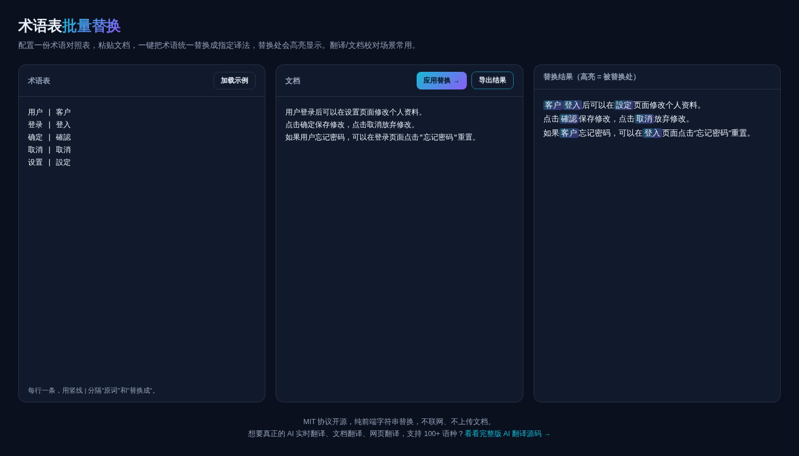

# 术语表批量替换 · Glossary Replacer

**[在线体验 →](https://anna123123123-creator.github.io/glossary-translate/)**

免费开源、纯浏览器运行的术语表批量替换工具。翻译、本地化、文档校对场景里经常需要把某些词统一成规定译法（比如公司内部规定"用户"要统一写成"客户"），这个工具帮你一次性替换完，替换处高亮显示，方便复查。不联网、不上传文档。



## 试用方法

直接用浏览器打开 `index.html`，或用静态文件服务器跑起来：

```bash
python3 -m http.server 8000
```

## 术语表格式

```
原词 | 替换成
用户 | 客户
登录 | 登入
```

每行一条，用竖线 `|` 分隔。较长的术语会优先匹配，避免和短术语互相冲突。

## 协议

MIT。

## 需要定制版？

这个工具免费开源、可以直接用。如果你需要的是**改造成适合自己业务的版本**——换品牌、改字段、加功能、接后端或数据库——我可以做。

- **交付周期**：3–10 个工作日
- **交付内容**：完整源码（不加密、可自行二次开发）+ 在线地址 + 部署说明
- **已有 49 套现成系统**可直接改造，覆盖电商、教育、门店、内容、跨境等行业：[全部清单与在线演示](https://inzyxuashop.com)

把你的需求发给我，24 小时内回复可行性与报价：**evcdecd@gmail.com**
